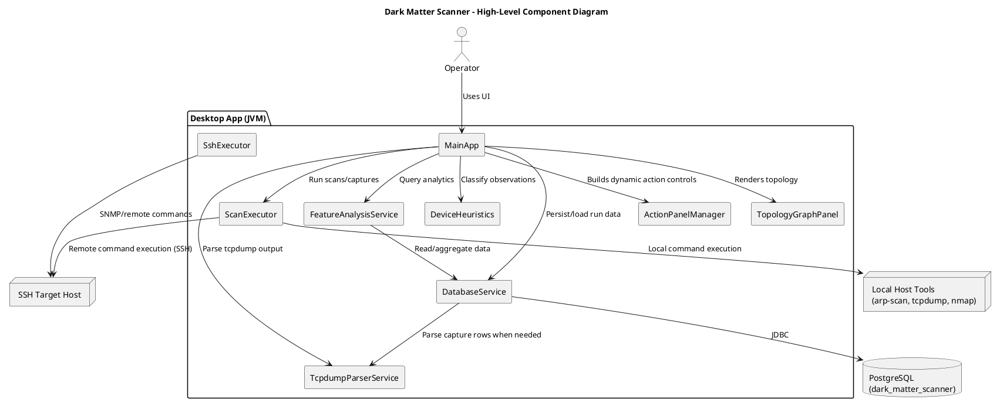

# Dark Matter Scanner

Dark Matter Scanner is a Java Swing desktop application for discovering and profiling network devices that may not show up in inventory systems.  
It combines active discovery (`nmap`), passive capture (`tcpdump`), optional remote execution over SSH, and PostgreSQL-backed analysis views.

## What it does

- Runs discovery scans and stores scan history.
- Captures live L2 traffic and parses ARP/IP observations.
- Enriches discovered hosts with TCP/UDP service probes.
- Flags dark/unaccounted behavior using built-in heuristics.
- Provides UI actions for SNMP walk and OUI metadata tagging.
- Renders topology and analysis views from stored captures.

## Tech stack

- Java (Swing desktop app)
- PostgreSQL (storage + analysis views)
- External tools: `nmap`, `tcpdump`, `ifconfig`, `snmpwalk`
- Optional remote execution: SSH (JSch)

## Prerequisites

1. Linux environment with Java (JDK 17+ recommended).
2. PostgreSQL running locally, with a database named `dark_matter_scanner`.
3. These binaries installed on the machine running scans (local or remote SSH target):
   - `nmap`
   - `tcpdump`
   - `ifconfig` (usually from `net-tools`)
   - `snmpwalk` (usually from `snmp`)
4. Sudo rights for commands that require elevated capture/scan privileges (for local mode, the app uses `sudo` for some commands).

## Database setup

Create and load the schema:

```bash
createdb dark_matter_scanner
psql -d dark_matter_scanner -f lib/dark-matter-pgsql-schema.sql
```

The current JDBC settings are hardcoded in [`DatabaseService.java`](src/dark_matter_scanner/DatabaseService.java):

- URL: `jdbc:postgresql://localhost:5432/dark_matter_scanner`
- User: `postgres`
- Password: `doonoot`

Update these values before running in any non-local or shared environment.

## Build

From the project root:

```bash
mkdir -p out/classes
javac -cp "lib/*" -d out/classes src/dark_matter_scanner/*.java
```

## Run

```bash
java -cp "out/classes:lib/*" dark_matter_scanner.MainApp
```

## Typical workflow

1. Launch app.
2. Choose local mode or enable SSH mode and provide target host credentials.
3. Click **Load Interfaces** and select an interface.
4. Enter subnet (for example `192.168.10.0/24`).
5. Click **Start Scan** to run discovery + live capture.
6. Click **Stop Scan** to finalize capture, parse/store rows, and run enrichment.
7. Review history, topology, dark node analysis, and optional SNMP/OUI actions.

## Project layout

- [`src/dark_matter_scanner/MainApp.java`](src/dark_matter_scanner/MainApp.java): UI + workflow orchestration.
- [`src/dark_matter_scanner/ScanExecutor.java`](src/dark_matter_scanner/ScanExecutor.java): local/SSH command execution and streaming capture.
- [`src/dark_matter_scanner/DatabaseService.java`](src/dark_matter_scanner/DatabaseService.java): JDBC access and persistence.
- [`src/dark_matter_scanner/TcpdumpParserService.java`](src/dark_matter_scanner/TcpdumpParserService.java): parser for tcpdump lines.
- [`src/dark_matter_scanner/FeatureAnalysisService.java`](src/dark_matter_scanner/FeatureAnalysisService.java): summary and dark-device analysis queries.
- [`lib/dark-matter-pgsql-schema.sql`](lib/dark-matter-pgsql-schema.sql): PostgreSQL schema dump.
- [`docs/uml/high-level-components.puml`](docs/uml/high-level-components.puml): high-level architecture diagram.

## High-level UML

Source of truth: [`docs/uml/high-level-components.puml`](docs/uml/high-level-components.puml)



## Notes

- Defaults in the UI include sample SSH credentials/host and subnet; treat them as development placeholders.
- Remote mode assumes required tools are installed on the SSH target host.
- `out/` contains compiled artifacts and can be regenerated from source.
